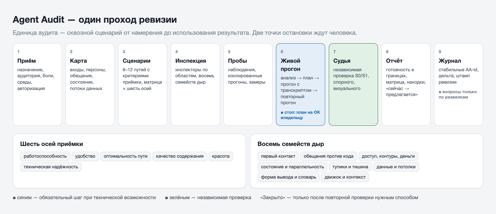
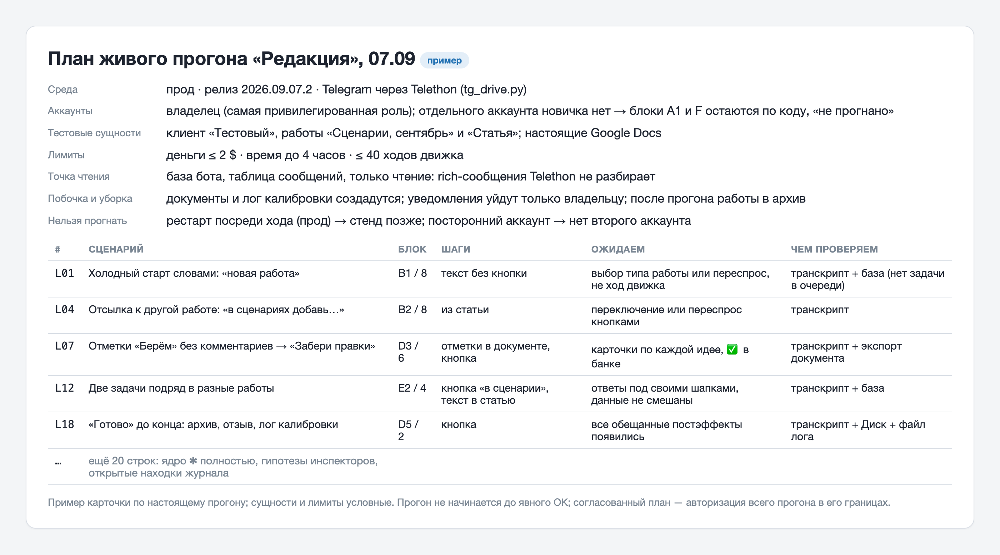
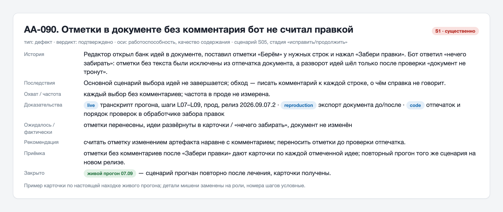

# Agent Audit

Скилл для [Claude Code](https://docs.anthropic.com/en/docs/claude-code), который
проверяет, готов ли ваш бот, агент, CLI или MCP-сервер к тому, чтобы им пользовались
люди без вас рядом. Это не ревью кода и не аудит безопасности. Вопрос один: получит ли
человек результат, и что случится, когда он пойдёт не по счастливому пути.

Вот как прошла одна настоящая ревизия. Мишень — редакционный Telegram-бот с очередью
задач, LLM-движком и Google Docs (в справочниках скилла он зовётся «Редакция»).

**День первый. Полная ревизия по коду.** Карта агента на сто строк: входы, персоны,
обещания, состояние, потоки данных. Четырнадцать сквозных сценариев от «новичок пишет
первый раз» до «две задачи параллельно». Четыре инспектора по областям, независимый
судья. В журнале 40 находок, из них выросло техзадание на семь накатов.

**День четвёртый, утро. Ревизия-дифф после накатов.** Все 40 закрыты по коду и тестам,
185 зелёных. Но повторный проход нашёл ещё 44, две из них существенные: длинная вставка
и кнопка «повторить» запускали движок в чужой работе мимо проверки владельца. 29 закрыты
в тот же день.

**День четвёртый, после обеда. Живой прогон.** Аудитор сел в настоящий Telegram и прошёл
сценарии руками: стратегия → статья → правки редактора в реальном документе → «Готово».
Полдня, 18 находок. Две существенные были невидимы по коду: отметки в документе без
комментария бот не считал правкой, а обещанная в документации автоматика в коде
оказалась строкой `TODO`. Их поймали только потому, что сценарий довели до финала.



После этого живой прогон стал обязательным шагом скилла, а не удачной импровизацией.
Дальше в README — что именно скилл делает, почему это не то же самое, что «попросить
модель проверить бота», и как его поставить.

---

## Что делает

Берёт репозиторий агента и проходит его как пользователь, а не как программист: строит
карту (кто может дёрнуть, что обещано, где живёт состояние, куда текут данные), задаёт
сквозные сценарии с критериями приёмки, прослеживает каждый через код, гоняет мишень
вживую через настоящий интерфейс, отдаёт находки независимому судье и пишет отчёт,
понятный человеку со стороны. Всё это оставляет в репозитории мишени журнал с постоянными
номерами находок, поэтому следующая ревизия проверяет дельту, а не начинает заново.

Каждая находка оценивается по шести осям: работоспособность, удобство, оптимальность
пути, качество содержания, красота и техническая надёжность. Исправный хендлер не
доказывает, что человек получил результат; красивое сообщение не доказывает, что данные
не перепутались между пользователями.

## Зачем это, если можно просто попросить модель «проверь бота»

Можно. И получится список замечаний по стилю кода, пара гипотез без доказательств
и вывод «в целом всё хорошо». Проверено: первые ручные ревизии выглядели именно так,
пока их не превратили в протокол.

Ценность здесь не в промпте, а в дисциплине вокруг модели.

| Проблема | Что делает Agent Audit |
|----------|------------------------|
| Модель читает хендлеры и считает, что сценарий работает | Единица проверки — **сквозной сценарий из шести стадий**: понять → задать → пройти → получить → использовать → исправить. На каждой стадии отдельно проверяются отмена, ошибка, повтор и восстановление |
| Модель выдаёт мнение за факт | У каждой находки **независимые поля**: тип, вердикт, источник доказательства (code / reproduction / logs / visual / live / user-observation). Скриншот не доказывает изоляцию данных, лог не доказывает красоту, транскрипт прогона не доказывает вид сообщения |
| «Красиво» оценивается по HTML-разметке | Красота — самостоятельная ось, но **только по фактически отображённому** результату: реальный клиент, реальный документ. Нет просмотра — «не проверено», а не «пройдено» |
| Нашла одно и объявила «всё сломано» / не нашла и объявила «чисто» | Серьёзность S0–S3 **по последствиям**, а не по теме. Ноль попыток пользователей — не нулевая успешность. Пилот только владельца — не доказательство плохого онбординга. Одно удачное выполнение — один удачный случай |
| Проверяет то, что видно в коде | **Восемь семейств дыр** с прецедентами из живых ботов: первый контакт, обещания против кода, доступ и деньги, состояние и параллельность, тупики и тишина, данные и потолки, форма вывода и словарь, движок и контекст. Инспектор узнаёт знакомое и пишет «не в каталоге» для нового |
| Тесты на заглушках зелёные, а в бою не работает | **Живой прогон обязателен**, если есть транспорт к мишени, разрешённая среда и бюджет. Без него вывод «готов к использованию» запрещён |
| Сама себе судья | **Независимый судья** перепроверяет все существенные находки по коду, транскриптам и артефактам; выводы карты и инспектора доказательством не считаются |
| Каждая ревизия с нуля, находки теряются | **Журнал** в `docs/audits/` мишени со стабильными `AA-id`: открыто / закрыто / регресс. «Закрыто» — только после повторной проверки нужным способом |

## Как устроено

| Шаг | Что происходит | Что остаётся |
|-----|----------------|--------------|
| **1. Приём** | Назначение, аудитория, боли, доступные среды и авторизация. Вопросы только по недостающему | — |
| **2. Карта** | Стек и цены, точки входа, персоны, состояние, потоки данных, три слоя обещаний, области для инспекторов | `docs/audits/map.md` |
| **3. Сценарии** | 6–12 сквозных путей с критериями приёмки: новичок, частая задача, сложная, исправление, возврат после перерыва, сбои | матрица «сценарий × шесть осей» |
| **4. Инспекция** | Каждый сценарий через все компоненты, восемь семейств дыр. Параллельные инспекторы по областям, у каждого пути один ответственный | файлы находок |
| **5. Пробы** | Наблюдения в разрешённой среде, изолированные прогоны, замеры: попытки, успехи, ожидание, расход | измерения или честное «не измерено» |
| **6. Живой прогон** | Анализ → план сценариев на согласование с владельцем → прогон через настоящий интерфейс с транскриптом → лечение → повторный прогон | транскрипт, снимки, план |
| **7. Верификация** | Независимый судья: все S0/S1, спорное, визуальное, рекомендации об оптимальности | вердикты, дубли объединены |
| **8. Отчёт** | Готовность в проверенных границах, матрица сценариев, находки, «сейчас → предлагается», что не проверено | `docs/audits/YYYY-MM-DD.md` |
| **9. Журнал** | Стабильные `AA-id`, дельта, штамп ревизии | `docs/audits/ledger.md` |

Внутри две точки остановки, где скилл ждёт человека: **план живого прогона** он
показывает до того, как отправит боту первое сообщение, а **вопросы владельцу** задаёт
только по реальным развилкам, не устраивая обязательный опрос. Мишень скилл не чинит:
это отдельное поручение.

Режимы: первая ревизия, повторная (полный проход и дельта журнала), дифф (изменения
с подтверждённой прошлой ревизии и затронутые сценарии), точечная (названные сценарии,
остальное явно вне проверки).

## Живой прогон

Самая ценная и самая дисциплинированная часть. Идёт в три такта, и прогон не начинается,
пока план не согласован.

1. **Анализ.** Что можно и нельзя прогнать вживую, гипотезы инспекторов, открытые
   находки прошлых ревизий, обещания справки, доступные аккаунты и их роли.
2. **План.** Широкий список сценариев в одной карточке: среда, релиз, аккаунты, тестовые
   сущности, лимит денег, точка чтения полного ответа, побочные эффекты и уборка. Владелец
   вычёркивает, добавляет и даёт ОК. Согласованный план — авторизация всего прогона в его
   границах; за границами — повторное согласование.
3. **Прогон.** По одному сценарию, каждый шаг в транскрипт: что отправлено, что нажато,
   что ответил бот, через сколько секунд. Находка → лечение по поручению → повторный прогон
   того же сценария на новом релизе. Без повторного прогона находка не закрыта.



Каталог универсальных сценариев — восемь блоков, ядро входит в план всегда:

| Блок | Что проверяется |
|------|-----------------|
| **A. Первый контакт** | Холодный старт без подсказок; каждая команда справки выполнена вживую; витрина до первого сообщения |
| **B. Понимание речи** | Каждое кнопочное действие сказано словами в трёх формулировках; отсылка к другой сущности по смыслу; мусорный ввод получает подсказку, а не тишину и не ход движка |
| **C. Основной путь** | Частая задача целиком с замером ходов, ожидания и стоимости; обратная связь во время ожидания; результат открывается и пересылается; в ответах нет путей, id и JSON |
| **D. Правка и продолжение** | Частичная правка меняет только нужное; правка руками в реальном документе переживает ход бота; возврат после паузы показывает «где мы»; финал доводится до всех обещанных постэффектов |
| **E. Параллельность** | Два действия подряд, две сущности параллельно, устаревшая кнопка, рестарт посреди хода |
| **F. Доступ** | Посторонний аккаунт: старт, команда, чужая кнопка, deep-link. Без второго аккаунта — честное «не прогнано» |
| **G. Вид** | Снимки каждого типа сообщения в реальном клиенте на телефоне и десктопе; документ в реальном рендерере |
| **H. Наблюдаемость и деньги** | Каждый ход оставил след в логах и базе, лишних ходов движка нет; время и стоимость каждого хода |

Для Telegram-ботов в комплекте `scripts/tg_drive.py`: читает чат с ботом, отправляет
сообщения, нажимает inline-кнопки, ждёт ответов и пишет JSONL-транскрипт. Пишет **только
названному боту** и отказывается от любого адресата без признака bot.

```bash
export TG_API_ID=…  TG_API_HASH=…        # my.telegram.org; сессия в ~/.agent-audit/
python3 scripts/tg_drive.py --bot @your_bot read 5
python3 scripts/tg_drive.py --bot @your_bot send "новая задача" --wait 20 --transcript live.jsonl
python3 scripts/tg_drive.py --bot @your_bot click 1234 "Готово" --transcript live.jsonl
```

Rich-сообщения некоторых ботов Telethon не разбирает, поэтому карта агента содержит
«точку чтения полного ответа»: база, лог или экспорт, откуда аудитор берёт текст только
чтением.

## Что получаете

Отчёт в `docs/audits/` мишени с двумя слоями: верхний понятен владельцу продукта,
технические детали свёрнуты для исполнителя. Каждая находка — карточка с историей
пользователя, последствиями, доказательством и критерием приёмки:



Плюс матрица «сценарий × шесть осей», где «не проверено» никогда не маскируется под
«пройдено», раздел «сейчас → предлагается» для существенного трения, список того, что
проверено без замечаний (это ориентиры, которые стоит сохранить при исправлении), и
порядок исправлений: блокирующее → существенное → улучшения → полировка.

## Принципы

- **Единица аудита — путь человека, а не функция.** Сценарий считается пройденным, когда
  результат открыт, прочитан и его можно поправить, а не когда «хендлер отработал».
- **Доказательство важнее мнения.** Гипотеза остаётся гипотезой, пока не воспроизведена,
  не прочитана в логе или не увидена на снимке. Судья может потребовать дочитать.
- **Не выдавать «чисто» за пределами проверенного.** Границы ревизии — часть вывода о
  готовности. Ноль наблюдений — не ноль проблем.
- **Живой прогон обязателен, план до прогона обязателен.** Аудитор не пишет боту, пока
  владелец не увидел список сценариев, и не пишет никому, кроме бота.
- **Аудит не чинит.** Изолированные диагностические проверки — да; правка мишени, прод,
  реальные люди и деньги — только по отдельному поручению.
- **Серьёзность по последствиям.** Нечитаемый основной документ может быть S1, мелкий
  технический дефект — S3. Предпочтение автора не изображается критическим дефектом.

## Что нужно

**Обязательно:** Claude Code и Python 3.8+. Скрипты карты и журнала используют только
стандартную библиотеку.

**Для живого прогона Telegram-бота:** Telethon 1.44 или новее, `api_id` и `api_hash`
вашего приложения с my.telegram.org, аккаунт, от которого пойдёт прогон.

```bash
pip3 install telethon
```

**Для параллельных инспекторов и судьи:** субагенты Claude Code. Их роли лежат в
`references/roles/` и копируются в `~/.claude/agents/`. Без субагентов скилл работает
последовательно и честно пишет в отчёте, что независимой проверки не было.

## Установка

```bash
git clone https://github.com/TimurUgulava/agent-audit.git ~/.claude/skills/agent-audit
cp ~/.claude/skills/agent-audit/references/roles/*.md ~/.claude/agents/
```

Новые типы агентов Claude Code подхватывает в следующей сессии. Проверка скриптов:

```bash
cd ~/.claude/skills/agent-audit && python3 -m unittest discover -s tests -v
```

**Без git**: **Code → Download ZIP** на странице репозитория, распаковать в
`~/.claude/skills/agent-audit` (на Windows — `C:\Users\<вы>\.claude\skills\agent-audit`,
команда `python` вместо `python3`).

## Как использовать

Откройте Claude Code в репозитории агента и скажите:

- «проверь бота»
- «аудит агента»
- «найди дыры в сценариях»
- «ревизия после релиза» или «аудит диффа»
- «прогони бота живьём»

Дальше скилл сам: соберёт карту, предложит сценарии, разведёт инспекторов, покажет план
живого прогона и дождётся вашего ОК, отдаст находки судье, положит отчёт и журнал в
`docs/audits/`. Первая ревизия небольшого бота занимает пару часов работы модели; живой
прогон — ещё полдня, если сценариев два-три десятка.

Скрипты работают и руками:

```bash
# корпус обещаний из кода: команды, подписи кнопок, тексты ответов
python3 scripts/extract_promises.py /path/to/bot --md --full

# журнал: статус, открытые находки, следующий id, штамп ревизии
python3 scripts/ledger.py /path/to/bot status
python3 scripts/ledger.py /path/to/bot open
python3 scripts/ledger.py /path/to/bot stamp 2026-09-07 abc1234 дифф --report 2026-09-07.md
```

## Безопасность

**Секреты мишени.** Скилл не читает `.env`, ключи и файлы с секретами, не выводит сырые
логи и конфиги, которые могут их содержать. Продовую базу открывает только для чтения
и только с разрешения; миграции, рестарты и запись на проде запрещены.

**Живой прогон.** Авторизация — согласованный план: среда, аккаунты, тестовые сущности,
лимит денег. `tg_drive.py` берёт `api_id` и `api_hash` из переменных окружения, не
принимает их аргументами и не печатает; файл сессии лежит локально и закрыт от git.
Скрипт пишет только названному боту: сущность без признака bot отвергается, так что
сообщение живому человеку от вашего имени невозможно по построению.

**Что уходит с вашей машины.** Ничего, кроме трафика Telegram при живом прогоне и
запросов к вашей модели через Claude Code. Телеметрии нет, своих серверов у скилла нет.

## Структура

```
agent-audit/
├── SKILL.md                          # протокол: девять шагов, режимы, границы
├── references/
│   ├── map.md                        # карта агента: десять разделов
│   ├── scenarios.md                  # сквозные сценарии, шесть стадий, возмущения
│   ├── evidence.md                   # доказательства, вердикты, серьёзность S0–S3
│   ├── journey-quality.md            # удобство, оптимальность, качество содержания
│   ├── visual-review.md              # красота по фактически отображённому результату
│   ├── live-drive.md                 # живой прогон: три такта и каталог сценариев
│   ├── probes.md                     # наблюдения, изолированные проверки, границы доступа
│   ├── hole-catalog.md               # именованные паттерны дыр с прецедентами
│   ├── families/01…08-*.md           # восемь семейств: что проверять, где искать, лечения
│   ├── inspector-brief.md            # задание инспектору и формат находки
│   ├── report-template.md            # отчёт и совместимый журнал
│   └── roles/                        # субагенты: инспектор и судья
├── scripts/
│   ├── extract_promises.py           # корпус обещаний из кода бота
│   ├── ledger.py                     # журнал ревизий и находок
│   └── tg_drive.py                   # живой прогон Telegram-бота
├── tests/test_scripts.py             # регрессионные проверки скриптов
└── evals/                            # контрольные кейсы качества самого аудитора
```

---

## Автор

[Тимур Угулава](https://t.me/+ZPqkVNfhlA1mNWIy) — про AI-ассистентов, скиллы
и то, как это всё приделать к живой работе.

Прецеденты в справочниках — из трёх настоящих ботов автора: командного планировщика,
домашней библиотеки и редакции. Имена людей и продуктов в них заменены на роли.

## Лицензия

MIT — делайте что хотите, ссылка приветствуется.
